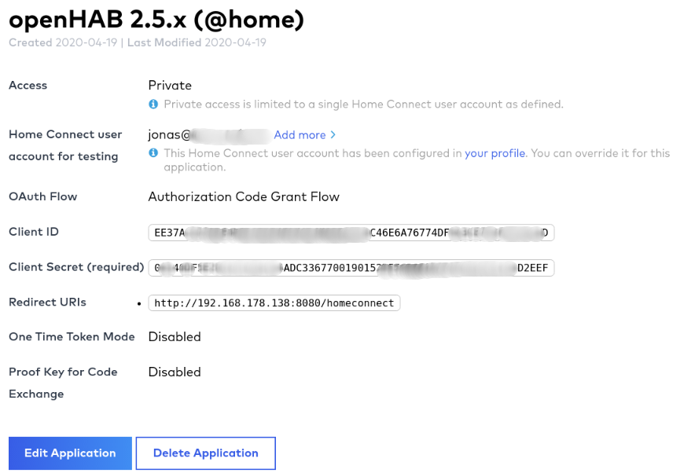
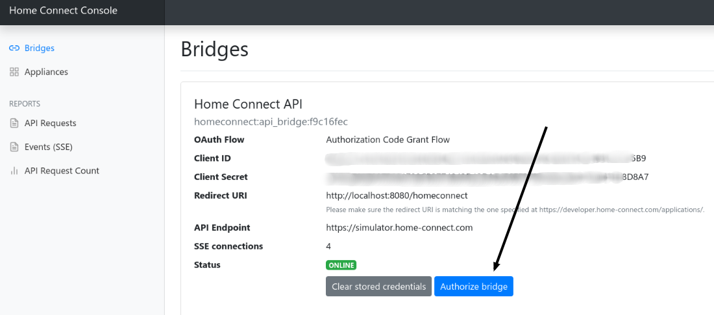
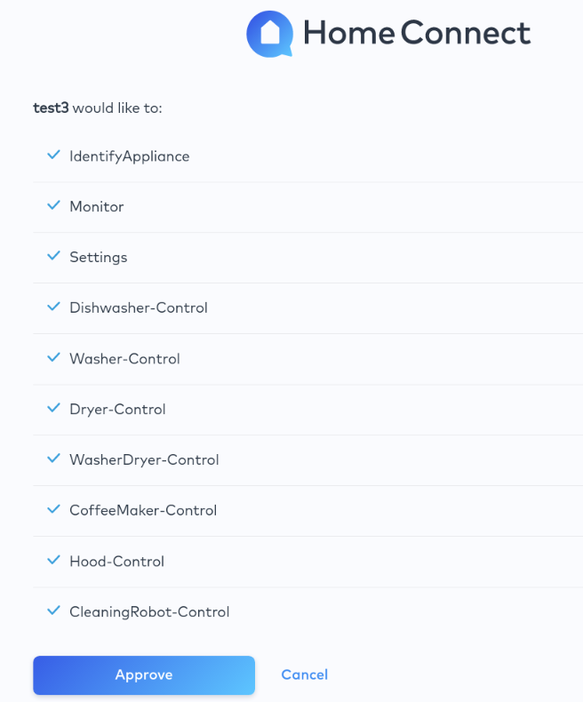

# Home Connect Binding

The binding integrates the [Home Connect](https://www.home-connect.com/) system into openHAB.
It uses the Home Connect API to connect to household devices from brands like Bosch and Siemens. 

As all status updates and commands have to go through the API, a permanent internet connection is required.

## Supported Things

### Bridge

The __Home Connect API__ is responsible for the communication with the Home Connect API. All devices use a bridge to execute commands and listen for updates. Without a working bridge the devices cannot communicate.

### Devices

Supported devices: Dishwasher, Washer, Washer / Dryer combination, Dryer, Oven, Hood, Cooktop, Refrigerator Freezer, Coffee Machine

| Home appliance | Thing Type ID    | 
| --------------- | ------------ |
| Dishwasher | dishwasher | 
| Washer | washer | 
| Washer / Dryer combination | washerdryer | 
| Dryer | dryer | 
| Oven | oven | 
| Hood | hood | 
| Cooktop | hob | 
| Refrigerator Freezer | fridgefreezer | 
| Coffee Machine | coffeemaker | 


## Discovery

After the bridge has been added, devices are discovered automatically.


## Channels

| Channel Type ID | Item Type    | Read only | Description  | Available on thing |
| --------------- | ------------ | --------- | ------------ | ------------------ |
| power_state | Switch | false | This setting describes the current power state of the home appliance. | dishwasher, oven, coffeemaker, hood, hob  | 
| door_state | Contact | true | This status describes the door state of a home appliance. A status change is either triggered by the user operating the home appliance locally (i.e. opening/closing door) or automatically by the home appliance (i.e. locking the door). | dishwasher, washer, washerdryer, dryer, oven, fridgefreezer | 
| operation_state | String | true | This status describes the operation state of the home appliance. | dishwasher, washer, washerdryer, dryer, oven, hood, hob, coffeemaker | 
| remote_start_allowance_state | Switch | true  | This status indicates whether the remote program start is enabled. This can happen due to a programmatic change (only disabling), or manually by the user changing the flag locally on the home appliance, or automatically after a certain duration - usually 24 hours. | dishwasher, washer, washerdryer, dryer, oven, hood, hob, coffeemaker | 
| remote_control_active_state | Switch | true  | This status indicates whether the allowance for remote controlling is enabled. | dishwasher, washer, washerdryer, dryer, oven, hood, hob | 
| active_program_state | String | true  | This status describes the active program of the home appliance. | dishwasher, washer, washerdryer, dryer, oven, hood, hob, coffeemaker  | 
| selected_program_state | String | false | This state describes the selected program of the home appliance. | dishwasher, washer, washerdryer, dryer, oven, hood, hob, coffeemaker | 
| remaining_program_time_state | Number:Time | true | This status indicates the remaining program time of the home appliance. | dishwasher, washer, washerdryer, dryer, oven | 
| elapsed_program_time | Number:Time | true | This status indicates the elapsed program time of the home appliance. | oven | 
| program_progress_state | Number:Dimensionless | true | This status describes the program progress of the home appliance. | dishwasher, washer, washerdryer, dryer, oven, coffeemaker | 
| duration | Number:Time | true | This status describes the duration of the program of the home appliance. | oven | 
| current_cavity_temperature | Number:Temperature | true | This status describes the current cavity temperature of the home appliance. | oven | 
| setpoint_temperature | Number:Temperature | false | This status describes the setpoint/target temperature of the home appliance. | oven | 
| laundry_care_washer_temperature | String | false | This status describes describes the temperature of the washing program of the home appliance. | washer, washerdryer | 
| laundry_care_washer_spin_speed | String | false | This status defines the spin speed of a washer program of the home appliance. | washer, washerdryer | 
| laundry_care_washer_idos1 | String | false | This status defines the i-Dos dosing level of a washer program of the home appliance. (If appliance supports i-Dos) | washer | 
| laundry_care_washer_idos2 | String | false | This status defines the i-Dos dosing level of a washer program of the home appliance. (If appliance supports i-Dos) | washer | 
| dryer_drying_target | String | false | This status defines the desired dryness of a program of the home appliance. | dryer, washerdryer | 
| setpoint_temperature_refrigerator | Number:Temperature | false | Target temperature of the refrigerator compartment (Range depends on appliance - common range 2 to 8°C). | fridgefreezer | 
| setpoint_temperature_freezer | Number:Temperature | false | Target temperature of the freezer compartment (Range depends on appliance - common range -16 to -24°C). | fridgefreezer | 
| super_mode_refrigerator | Switch | false | The setting has no impact on setpoint temperatures but will make the fridge compartment cool to the lowest possible temperature until it is disabled by the manually by the customer or by the HA because of a timeout. | fridgefreezer | 
| super_mode_freezer | Switch | false | This setting has no impact on setpoint temperatures but will make the freezer compartment cool to the lowest possible temperature until it is disabled by the manually by the customer or by the home appliance because of a timeout. | fridgefreezer | 
| coffeemaker_drip_tray_full_state | Switch | true | Is coffee maker drip tray full? | coffeemaker | 
| coffeemaker_water_tank_empty_state | Switch | true | Is coffee maker water tank empty? | coffeemaker | 
| coffeemaker_bean_container_empty_state | Switch | true | Is coffee maker bean container is empty? | coffeemaker | 
| hood_venting_level | String | false | This option defines the required fan setting of the hood. | hood | 
| hood_intensive_level | String | false | This option defines the intensive setting of the hood. | hood | 


            
## Thing Configuration

### Configuring the __Home Connect API__ Bridge


#### 1. Preconditions

1. Please create an account at [Home Connect](https://www.home-connect.com/) and add your physical appliance to your account.
2. Test the connection to your physical appliance via mobile app ([Apple App Store (iOS) ](https://itunes.apple.com/de/app/home-connect-app/id901397789?mt=8) or [Google Play Store (Android)](https://play.google.com/store/apps/details?id=com.bshg.homeconnect.android.release)).

#### 2. Create Home Connect developer account

1. Create an account at [https://developer.home-connect.com](https://developer.home-connect.com) and login.
2. Please make sure you've added your associated Home Connect account email at [https://developer.home-connect.com/user/me/edit](https://developer.home-connect.com/user/me/edit). You should set your email address, which you use for the offical Android or iOS app, at `Default Home Connect User Account for Testing`.  


3. Create an application at [https://developer.home-connect.com/applications](https://developer.home-connect.com/applications)
    * _Application ID_: e.g. `openhab-binding`
    * _OAuth Flow_: Authorization Code Grant Flow
    * _Home Connect User Account for Testing_: the associated user account email from [Home Connect](https://www.home-connect.com/)  
     **_Please don't use your developer account username_**
    * _Redirect URIs_: add your openHAB URL followed by `/homeconnect`  
    for example: `http://192.168.178.34:8080/homeconnect` or `https://myhome.domain.com/homeconnect`
    * _One Time Token Mode_: keep unchecked 
    * _Proof Key for Code Exchange_: keep unchecked
4. After your application has been created, you should see the _Client ID_ and _Client Secret_ of the application. Please save them for later.  



#### 3. Setup bridge (Paper UI)

The Home Connect bridge can be configured in the Paper UI as follows:

1. Go to the Inbox and press the add button
2. Choose `Home Connect Binding`
3. Select `Home Connect API`
4. Enter
    * __client id:__ your application client id
    * __client secret:__ your application client secret
    * __simulator:__ false
5. Now navigate to the URL (`Redirct URI`) you've  added to your Home Connect application in the previous step (2.3). For example `http://192.168.178.80:8080/homeconnect`.
6. Please follow the steps shown to authenticate your binding. You can redo this step every time. For example if you have authentication problems, just start wizard again.  
  
  
  
  

7. That's it! Now you can use autodiscovery to add devices. Your devices should show up if you start a scan inside the Paper UI Inbox.


## Examples: File based configuration

If you prefer to configure everything via file instead of PaperUI, here are some examples.

### things/homeconnect.things

```
Bridge homeconnect:api_bridge:simulator_api_bridge "Home Connect API (Simulator)" [ clientId="1234", clientSecret="1234", simulator=false] {
    // Thing configurations
    Thing dishwasher dishwasher1 "Dishwasher"  [ haId="SIEMENS-HCS02DWH1-6F2FC400C1EA4A" ]
    Thing washer washer1 "Washer"  [ haId="SIEMENS-HCS03WCH1-1F35EC2BE34A0F" ]
    Thing fridgefreezer fridge1 "Fridge Freezer  [ haId="SIEMENS-HCS05FRF1-7B3FA5EB3D885B" ]
    Thing oven oven1 "Oven"  [ haId="BOSCH-HCS01OVN1-2132B6FA25BA21" ]
    Thing dryer dryer1 "Dryer"  [ haId="BOSCH-HCS04DYR1-3921C766AD5BAF" ]
    Thing coffeemaker coffee1 "Coffee machine"  [ haId="BOSCH-HCS06COM1-2140A8821AE7AB" ]
}
```

### items/homeconnect.items

```
// dishwasher
Switch                 DishwasherSimulator_PowerState                  "Power State"                       {channel="homeconnect:dishwasher:dishwasher1:power_state"}
Contact                DishwasherSimulator_DoorState                   "Door State"                        {channel="homeconnect:dishwasher:dishwasher1:door_state"}
String                 DishwasherSimulator_OperationState              "Operation State"                   {channel="homeconnect:dishwasher:dishwasher1:operation_state"}
Switch                 DishwasherSimulator_RemoteStartAllowanceState   "Remote Start Allowance State"      {channel="homeconnect:dishwasher:dishwasher1:remote_start_allowance_state"}
Switch                 DishwasherSimulator_RemoteControlActiveState    "Remote Control Activation State"   {channel="homeconnect:dishwasher:dishwasher1:remote_control_active_state"}
String                 DishwasherSimulator_SelectedProgramState        "Selected Program"                  {channel="homeconnect:dishwasher:dishwasher1:selected_program_state"}
String                 DishwasherSimulator_ActiveProgramState          "Active Program"                    {channel="homeconnect:dishwasher:dishwasher1:active_program_state"}
Number:Time            DishwasherSimulator_RemainingProgramTimeState   "Remaining program time"            {channel="homeconnect:dishwasher:dishwasher1:remaining_program_time_state"}
Number:Dimensionless   DishwasherSimulator_ProgramProgressState        "Progress State"                    {channel="homeconnect:dishwasher:dishwasher1:program_progress_state"}
```

## Misc
Refreshing the authentication token does not work in simulated environment.


